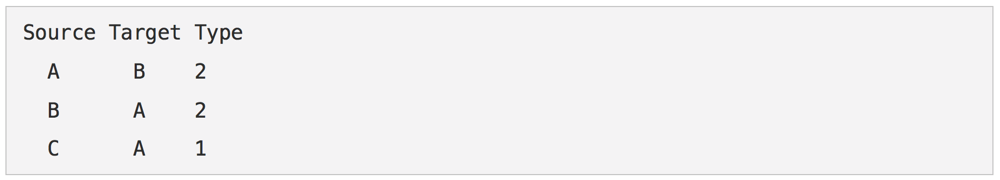
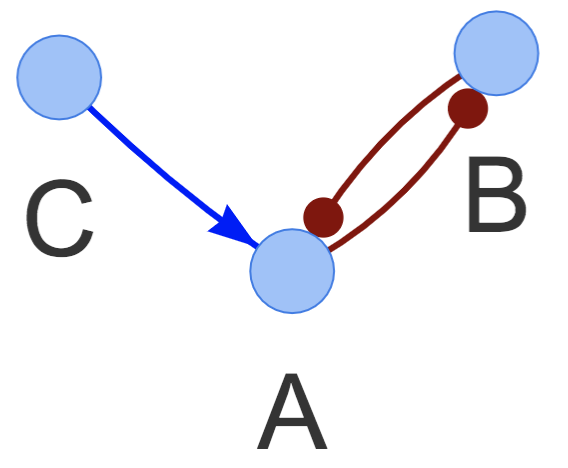

#### Circuit
In order to utilize GeneEx, users need to provide a circuit topology in the “Circuit” tab. Users have the option to upload a topology or build one from scratch.

Circuits are built using the interaction table found on the right half of the “Circuit” tab. This is how the default table looks like:

     
     

  

There are two types of interactions that can be submitted: inhibitory (input as the number 2) and excitatory (input as the number 1). Clicking the “Add Interaction” button allows you to add more custom interactions:

    

  

Alternatively, users can upload custom circuits in the left half of the “Circuit” tab:

  

GeneEx can process text files formatted in the following way:
 

 
A sample topology file can be downloaded from the `Example Circuit File` link found above the browse bar. 

Once a circuit is built or uploaded, the `Load Circuit` button should be clicked to load the circuit. This will display the topology as a network figure showing the nodes and their interactions. The excitatory interactions are shown in blue with normal arrowheads and the inhibitory interactions are shown in red with circles as the arrowhead. 

 
The circuit can be zoomed in or out by scrolling the mouse over it and clicking a gene will highlight all of its interactions.
