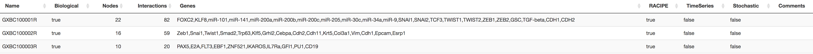

     
#### Database

The Database tab offers curated biological GRCs from published literature, 
and synthetic circuits to encourage additional exploration and sharing of their simulations. 

For ease of use, the database can be filtered by biological or synthetic GRC’s 
and has a search feature as well to locate specific circuits by their unique 
names or by gene names or any other attribute. Users can click on the circuits 
in the database to display the circuit and plot any corresponding saved data. 
Circuits with *TimeSeries* include their time trajectories for specific model 
parameters, such as the trajectories for limit cycle oscillations in three 
gene circuits. The database also includes *Stochastic* circuits that have been 
simulated with non-zero noise levels. The database will be expanded over time 
and users have the option to upload their circuits with or without a parameter 
set. *Note of caution:* Uploaded circuits will not be available in the database 
immediately, as they first need to be manually verified to maintain database integrity.

  
