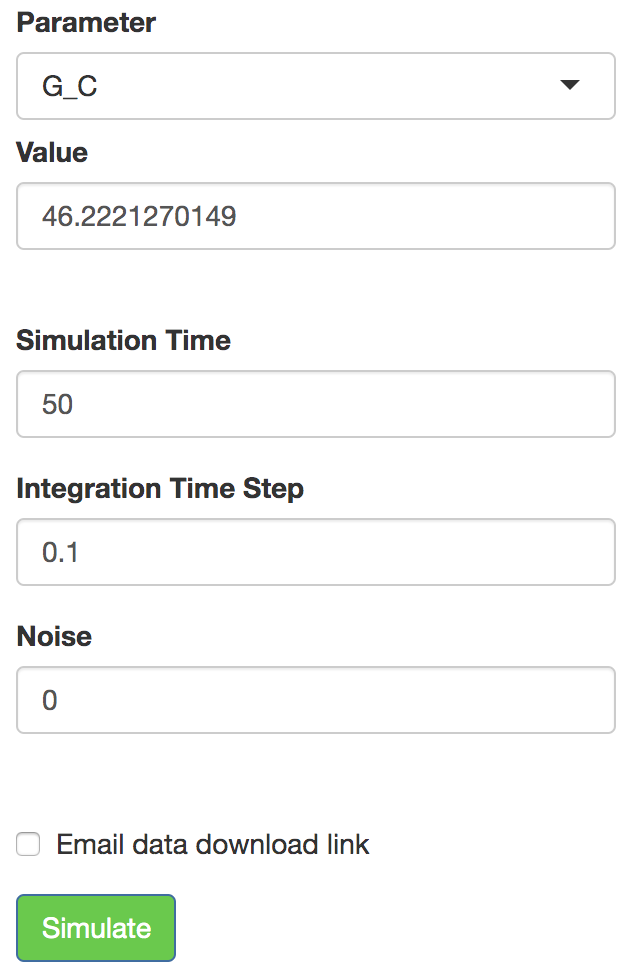
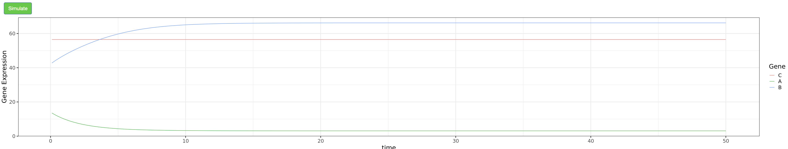
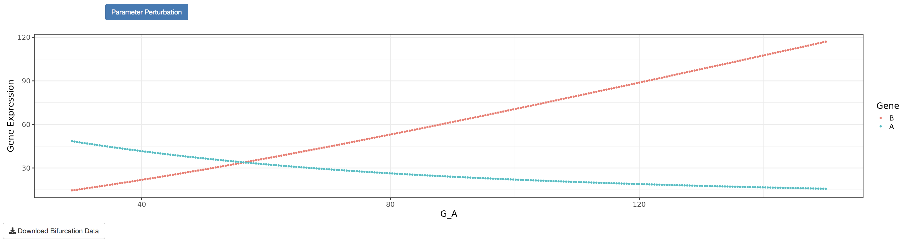

#### GeneVyuha

In the ODE-based mathematical modeling approach GeneEx uses (detailed in the “Theory” section of the tutorial), there are two parameters for each gene (the production and degradation rates of the gene) and three parameters for each interaction (the threshold, fold change and Hill coefficient of regulation). Thus, for a circuit with *Ng* genes and *Nreg* regulations, the total number of parameters is *2Ng+3Nreg*.

Varying the values of these parameters generates different time trajectories and steady state gene expression values. In the “GeneVyuha” tab (Vyuha - a sanskrit origin word meaning pattern/formation), users can simulate the trajectory/time series of a loaded circuit for a given set of parameters as well as interactively modify any parameter value to observe its effect on the time trajectory of gene expression values. 

Initially, a random parameter set is generated for the circuit. Users can change the value of any parameter once it is selected using the `Parameter` dropdown menu. Other options that control simulation criteria like simulation time, step size, and noise level can also be changed.

  
The label before the first underscore in each parameter name refers to the parameter itself. The label after the first underscore refers to the specific gene name or interaction (formatted as source gene and target gene, separated by another underscore). The order of parameters in the dropdown menu is as follows: Production rate (`G_`), degradation rate (`K_`), threshold (`TH_`), Hill coefficient (`N_`), and fold change (`FC_`). Once all the parameter values of interest are chosen, clicking `Simulate` will generate and display the time trajectories of the gene expression values for each gene. 

  

Furthermore, a `Parameter Perturbation` feature is made available after the initial simulation which plots the steady state expression  of each gene against a user selected parameter. The range of values for the selected parameter can be modified by the user (default values are *(0.5P - 2P)*, where *P* denotes the value of the parameter in the previous simulation). For this feature, GeneEx generates a large number of models with the selected parameter sampled from a uniform distribution over the range specified above and keeping the other parameters fixed. The models are simulated till `Simulation time` is reached to obtain the steady state gene expressions. 

Any observed bifurcation suggests that the model is multistable for some parameter values. In other words, for a specific parameter set, the initial conditions are what will determine which state the model will settle into.    
