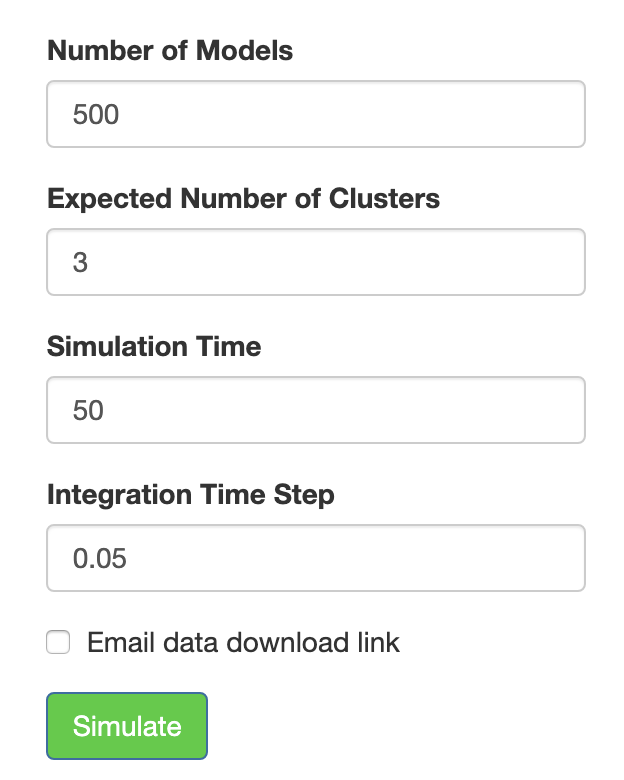
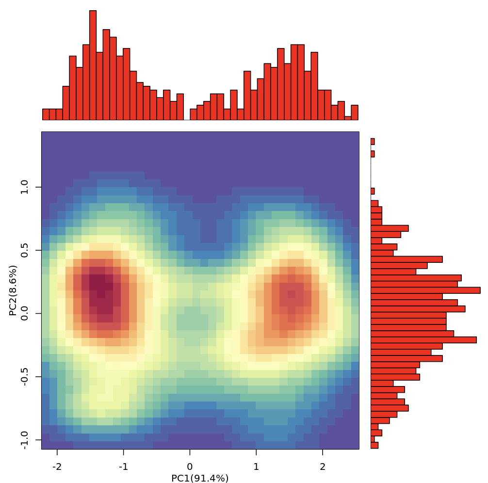
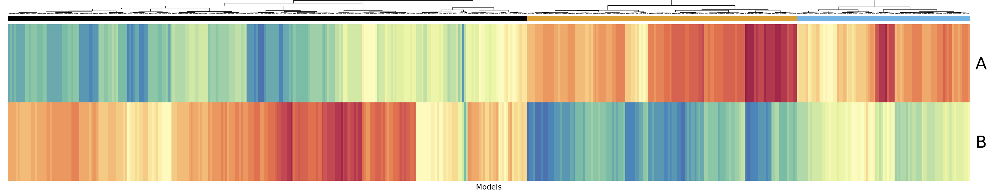
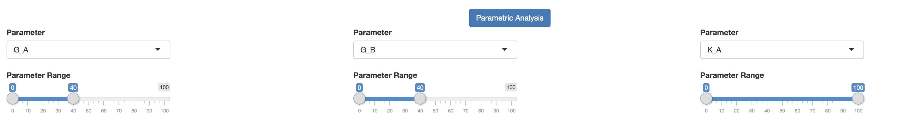
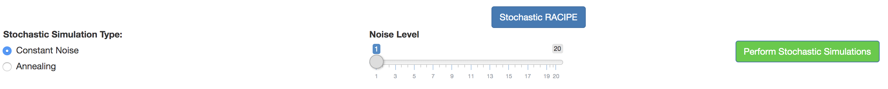

#### RACIPE

The RACIPE (RAndom CIrcuit PErturbation) tab uses an ODE-based mathematical modeling approach (detailed in the “Theory” section of the tutorial) to generate an ensemble of models with random parameters that correspond to the loaded circuit topology. RACIPE then utilizes a variety of statistical tools on the final gene expressions, obtained for each model, to identify some generic properties of the circuit. Unlike the “GeneVyuha” tab, which attempts to mimic a validation experiment by simulating the trajectories using a single set of kinetic parameters specified by the user, RACIPE attempts to describe the steady state behavior of an entire cell population by simulating a large number of models with random parameters. 

In RACIPE, the random values for each parameter are sampled uniformly from specific ranges: production rate (1-100), degradation rate (0.1-1), fold change (1-100), Hill coefficient of regulation (1-6). The sampling ranges of the thresholds for each interaction are calculated from the particular circuit topology. Each model is simulated using an initial condition sampled from a log distribution. For further details, please refer to 
the publications <cite><a href="https://journals.plos.org/ploscompbiol/article?id=10.1371/journal.pcbi.1005456">Interrogating the topological robustness of gene regulatory circuits by randomization</a></cite>  and <cite><a href="https://www.nature.com/articles/s41540-018-0076-x">Role of noise and parametric variation in the dynamics of gene regulatory circuits</a></cite>.

The RACIPE analysis begins with the user specifying simulation criteria: the number of models, parameter ranges, simulation time, integration time step, and the expected number of clusters. *Note of caution:* The simulation may take a  long time to complete if the network is very large, simulation time too high, the integration time step too small, the number of models too large, or a combination of all these. One can also provide an email to which a download link will be sent (from email: geneex.maintainer@gmail.com) that will allow downloading of the simulated data.

  

Clicking `Simulate` button will simulate the circuit and display the hierarchical clustering and principal components plots of the simulated gene expressions from each model. Note that the gene expressions are normalized and log transformed for downstream analysis, including the clustering analysis.

 
 

  

The simulated expression data is processed by a standard normalization method where gene expression levels from the models are normalized first by log transformation, and then by conversion to z-scores:  

  

Once the initial simulation is complete, other buttons labeled `Parametric Analysis` and `Stochastic RACIPE` will become available.

The parametric analysis section enables the user to study how a change in the parameter ranges will affect the gene expression clusters and patterns. The expanded area will contain a few sliders that will filter out any models whose specified parameter values are out-of-bounds of the slider percent range. For example, if the slider positions are at *10* and *50* for a parameter whose values were selected from a range *(1-100)*, the filtered data will contain only the models for which the value of selected parameter is in the range *(10-50)*. A maximum of three such filters can be applied simultaneously. The hierarchical clustering and principal components plots are redrawn for the filtered data each time any of the sliders are moved. Principal components of the original dataset are used in the plots for parametric analysis. *Note of caution:* If the slider percent intervals are too small, there will be a loss in statistical power since most of the models would have been filtered out. Parametric analysis is powerful feature because it can be used to test a variety of novel hypotheses. For example, limiting the production rate of a gene is analogous to a knockdown of that particular gene. 

In the Stochastic RACIPE section, one can incorporate stochastic effects into the RACIPE approach. The statistics can be calculated at multiple noise levels using two simulation schemes: (a) constant noise-based method which estimates the basin of attraction of various phenotypic states and (b) annealing based method which provides an estimate of the relative stability of the different phenotypic states. For further details please see <cite><a href="https://www.nature.com/articles/s41540-018-0076-x">Role of noise and parametric variation in the dynamics of gene regulatory circuits</a></cite>.

Clicking the `Stochastic RACIPE` button shows the inputs for stochastic simulations. `Stochastic Simulation Type` is a two-option button with options `Constant Noise` and `Annealing`. With `Constant Noise`, simulations are carried out by incorporating stochastic effects whose strength is proportional to the value selected in the `Noise Level` slider. With `Annealing`, the ensemble of models is simulated for a large (∼20) number of noise levels differing by a small amount. *Note of caution:* Due to the large number of simulations performed for annealing, the results can take a long time to be generated. Clicking `Perform Stochastic Simulations` will simulate the circuit and display the hierarchical clustering and principal components.

