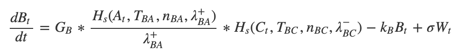

#### Theory

The ordinary differential equations (ODE’s) we use in GeneEx are chemical rate equations that model the expression of a gene (node) in a GRN. We then use numerical methods to solve these ODE’s and output the steady state gene expression of each gene in the GRN. Each equation takes on the following general form:

As an elementary example, the dynamics of an isolated gene (*B*) is modeled using the differential equation:

where *Bt* is defined as the expression of gene *B* at time *t*, and *gB* and *kB*, are parameters that represent the gene's basal production and degradation rates, respectively. In this straightforward case, the steady state is the expression level of gene *B* when *dBt/dt=0*:

If gene *B* is regulated by another gene *A*, then their interaction is modeled using the shifted Hill function, an equation that approximates the chemical kinetics of ligand bonding. Here we provide an heuristic explanation. Given an activator (*A*), the gene product of gene A, which can potentially bind *n* times to a promotor site on the DNA of gene B (*PBA*), we can use the principle of conservation of mass to state:

where *PT* is the total concentration of bound and unbound promotor. We are neglecting intermediate states where fewer than *n* activators are bound. Subsequently, using the theory of mass-action kinetics, we can state that the rate of concentration change for the activator-promotor complex is:

where *kon* and *koff* are the association and dissociation rate constants, respectively. Using the steady-state solution at which  *dnAPBA/dt = 0*, as well as the conservation of mass equation mentiond earlier, we can obtain **the fraction of unbound promotor**, also known as the Hill-Langmuir function:

where *n* is the Hill coefficient and *TBA* is the threshold constant and is defined as:

Although we derived the equations by assuming that *n* is the number of binding sites, *n* is commonly defined as the cooperativity of the regulation in the Hill function, and will be unique for every interaction (*nBA*, in the example above). 

In the simple case where gene *B* is activated by gene *A*, we can use a variation of the Hill function, known as the shifted Hill function(*Hs*), to model *the production rate* of gene B:

where *λ+BA* is the fold change of the regulation, or in other words, the degree to which the basal production rate is magnified, in the case of an activator, or diminished, in the case of an inhibitor (*λ-BA*). 

Using the shifted Hill function, we can now construct the ODE that models the rate of expression change of gene B at time t (*Bt*) as a function of activator A at time t (*At*):

The various tools in GeneEx implement a slightly modified version of the above rate equation that put the basal production *gB* in terms of the **maximal** production, *GB*, where:

For the more typical case where gene *B* has multiple regulators, the production parameter is multiplied by the shifted Hill function of each regulator. Here we can see the ODE for the rate of expression change of gene B at time t, when regulated by activator A and inhibitor C:

To account for stochastic effects due to cell to cell variation and low copy numbers in individual cells, GeneEx provides an option to include a noise term based on a Wiener process (*Wt*) with variance *σ2*:

The ODE’s built in GeneEx are solved using fourth order Runge-Kutta method and SDE’s are solved using Euler-Maruyama method.

