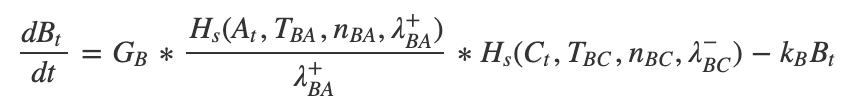
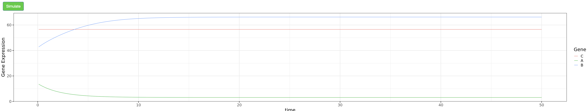
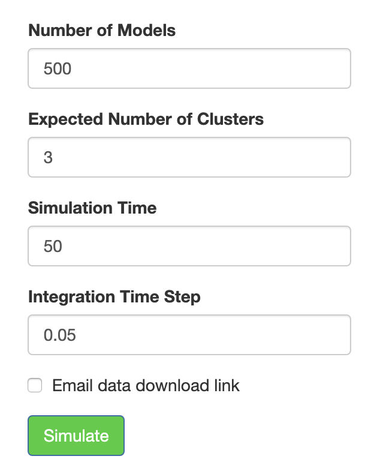
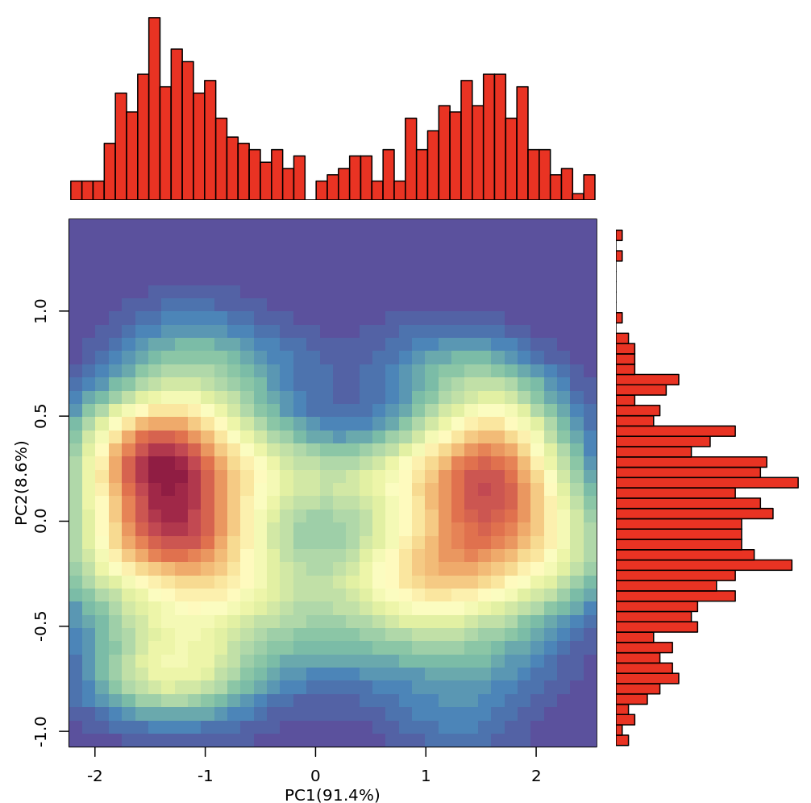
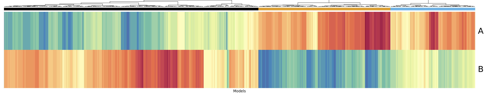
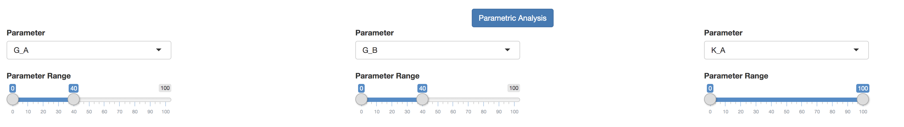

```{r setup, include=FALSE}
knitr::opts_chunk$set(echo = TRUE)
```

## Overview

Gene Circuit Explorer (GeneEx) is a systems-biology tool to visualize and simulate gene regulatory circuits (GRCs). It can simulate a single model with specific kinetic parameters or an ensemble of models using the random circuit perturbation approach with and without stochastic effects (sRACIPE/RACIPE) for a comprehensive understanding of the structure and function of the GRCs in cell populations. The randomization-based methods (RACIPE/sRACIPE) enable study of the effects of both the gene expression noise and the parametric variation on any GRC using only its topology by simulating an ensemble of models with random kinetic parameters at multiple noise levels. Statistical analysis of the generated gene expressions reveal the basin of attraction and stability of various phenotypic states generated by the GRC. Thus, GeneEx provides a holistic picture to evaluate the effects of both the stochastic nature of cellular processes and the parametric variation on GRCs.


GeneEx is based on [sRACIPE R package](https://bioconductor.org/packages/release/bioc/html/sRACIPE.html) available from 
BioConductor. Additional tutorials on sRACIPE and GeneEx are available [here](https://vivekkohar.github.io/sRACIPE/).


## Citation 

If you use this website in your reserach, please cite the papers [Interrogating the topological robustness of gene regulatory circuits by randomization](http://journals.plos.org/ploscompbiol/article?rev=2&id=10.1371/journal.pcbi.1005456) published in PLoS computational biology 13 (3), e1005456 and [Role of noise and parametric variation in the dynamics of gene regulatory circuits](https://www.nature.com/articles/s41540-018-0076-x) published in npj Systems Biology and Applications, 4, 40 (2018).

## Background
  Living cells can be described as a collection of complex dynamical systems that are responsible for constantly reconfiguring the cell's character in response to environmental stimuli. Gene regulatory networks (GRN’s) are one such type of dynamical system and are the focus of GeneEx, the webapp we describe in this tutorial. GRN’s can be described as an assembly of interacting transcription factors and other molecular regulators that control the gene expression levels for a given biological process. GRN’s have become a major area of study since changes in gene expression or network topology have been shown to drive a number of biological phenomena such as population heterogeneity, disease emergence, and the evolution of morphological novelties.  Moreover, GRN’s have been shown to be a useful tool for investigating a number of biological challenges such as the derivation of novel hypotheses about molecular interactions, elucidation of potential targets for drug design, and comparative analysis between different physiological or disease conditions.

Systems biology aims to understand how GRN’s and other dynamical systems function and cooperate by using a variety of modeling schemes to systematically perturb them. Mathematical modeling, the process of translating a biological relationship into a mathematical formulation, has witnessed a recent surge in popularity since obtaining complete operational pictures of GRN’s, using solely experimental approaches, has proven exigent. Consequently, a variety of unique computational approaches have been developed to model the dynamics of GRN’s such as Boolean network models, ordinary differential equations (ODEs)-based models, and Bayesian network models. This tutorial explores GeneEx, an interactive webtool we developed that uses an ODE-base mathematical modeling approach to simulate, visualize, and analyze GRN’s.

## Theory

The ordinary differential equations (ODE’s) we use in GeneEx are chemical rate equations that model the expression of a gene (node) in a GRN. We then use numerical methods to solve these ODE’s and output the steady state gene expression of each gene in the GRN. Each equation takes on the following general form:


As an elementary example, the dynamics of an isolated gene (*B*) is modeled using the differential equation:


where *B<sub>t</sub>* is defined as the expression of gene *B* at time *t*, and *g<sub>B</sub>* and *k<sub>B</sub>*, are parameters that represent the gene's basal production and degradation rates, respectively. In this straightforward case, the steady state is the expression level of gene *B* when *dB<sub>t</sub>/dt=0*:


If gene *B* is regulated by another gene *A*, then their interaction is modeled using the shifted Hill function, an equation that approximates the chemical kinetics of ligand bonding. Here we provide an heuristic explanation. Given an activator (*A*), the gene product of gene A, which can potentially bind *n* times to a promotor site on the DNA of gene B (*P<sub>BA</sub>*), we can use the principle of conservation of mass to state:


where *P<sub>T</sub>* is the total concentration of bound and unbound promotor. We are neglecting intermediate states where fewer than *n* activators are bound. Subsequently, using the theory of mass-action kinetics, we can state that the rate of concentration change for the activator-promotor complex is:


where *k<sub>on</sub>* and *k<sub>off</sub>* are the association and dissociation rate constants, respectively. Using the steady-state solution at which  *dnAP<sub>BA</sub>/dt = 0*, as well as the conservation of mass equation mentiond earlier, we can obtain **the fraction of unbound promotor**, also known as the Hill-Langmuir function:


where *n* is the Hill coefficient and *T<sub>BA</sub>* is the threshold constant and is defined as:


Although we derived the equations by assuming that *n* is the number of binding sites, *n* is commonly defined as the cooperativity of the regulation in the Hill function, and will be unique for every interaction (*n<sub>BA</sub>*, in the example above). 


In the simple case where gene *B* is activated by gene *A*, we can use a variation of the Hill function, known as the shifted Hill function(*H<sub>s</sub>*), to model *the production rate* of gene B:


where *$\lambda$ <sup>+<sup><sub>BA</sub>* is the fold change of the regulation, or in other words, the degree to which the basal production rate is magnified, in the case of an activator, or diminished, in the case of an inhibitor (*$\lambda$ <sup>-<sup><sub>BA</sub>*). 

Using the shifted Hill function, we can now construct the ODE that models the rate of expression change of gene B at time t (*B<sub>t</sub>*) as a function of activator A at time t (*A<sub>t</sub>*):


The various tools in GeneEx implement a slightly modified version of the above rate equation that put the basal production *g<sub>B</sub>* in terms of the **maximal** production, *G<sub>B</sub>*, where:


For the more typical case where gene *B* has multiple regulators, the production parameter is multiplied by the shifted Hill function of each regulator. Here we can see the ODE for the rate of expression change of gene B at time t, when regulated by activator A and inhibitor C:




To account for stochastic effects due to cell to cell variation and low copy numbers in individual cells, GeneEx provides an option to include a noise term based on a Wiener process (*W<sub>t</sub>*) with variance *$\sigma$<sup>2</sup>*:


The ODE’s built in GeneEx are solved using fourth order Runge-Kutta method and SDE’s are solved using Euler-Maruyama method.


## Circuit
In order to utilize GeneEx, users need to provide a circuit topology in the “Circuit” tab. Users have the option to upload a topology or build one from scratch.

Circuits are built using the interaction table found on the right half of the “Circuit” tab. This is how the default table looks like:


     
     

<br> 


There are two types of interactions that can be submitted: inhibitory (input as the number 2) and excitatory (input as the number 1). Clicking the “Add Interaction” button allows you to add more custom interactions:

    

<br> 


Alternatively, users can upload custom circuits in the left half of the “Circuit” tab:


<br> 


GeneEx can process text files formatted in the following way:
<br>


<br>
A sample topology file can be downloaded from the `Example Circuit File` link found above the browse bar. </p>

Once a circuit is built or uploaded, the `Load Circuit` button should be clicked to load the circuit. This will display the topology as a network figure showing the nodes and their interactions. The excitatory interactions are shown in blue with normal arrowheads and the inhibitory interactions are shown in red with circles as the arrowhead. 


<br>
The circuit can be zoomed in or out by scrolling the mouse over it and clicking a gene will highlight all of its interactions.

## GeneVyuha

In the ODE-based mathematical modeling approach GeneEx uses (detailed in the “Theory” section of the tutorial), there are two parameters for each gene (the production and degradation rates of the gene) and three parameters for each interaction (the threshold, fold change and Hill coefficient of regulation). Thus, for a circuit with *N<sub>g</sub>* genes and *N<sub>reg</sub>* regulations, the total number of parameters is *2N<sub>g</sub>+3N<sub>reg</sub>*.


Varying the values of these parameters generates different time trajectories and steady state gene expression values. In the “GeneVyuha” tab (Vyuha - a sanskrit origin word meaning pattern/formation), users can simulate the trajectory/time series of a loaded circuit for a given set of parameters as well as interactively modify any parameter value to observe its effect on the time trajectory of gene expression values. 


Initially, a random parameter set is generated for the circuit. Users can change the value of any parameter once it is selected using the `Parameter` dropdown menu. Other options that control simulation criteria like simulation time, step size, and noise level can also be changed.


<br> 
The label before the first underscore in each parameter name refers to the parameter itself. The label after the first underscore refers to the specific gene name or interaction (formatted as source gene and target gene, separated by another underscore). The order of parameters in the dropdown menu is as follows: Production rate (`G_`), degradation rate (`K_`), threshold (`TH_`), Hill coefficient (`N_`), and fold change (`FC_`). Once all the parameter values of interest are chosen, clicking `Simulate` will generate and display the time trajectories of the gene expression values for each gene. 




<br> 


Furthermore, a `Parameter Perturbation` feature is made available after the initial simulation which plots the steady state expression  of each gene against a user selected parameter. The range of values for the selected parameter can be modified by the user (default values are *(0.5P - 2P)*, where *P* denotes the value of the parameter in the previous simulation). For this feature, GeneEx generates a large number of models with the selected parameter sampled from a uniform distribution over the range specified above and keeping the other parameters fixed. The models are simulated till `Simulation time` is reached to obtain the steady state gene expressions. 


Any observed bifurcation suggests that the model is multistable for some parameter values. In other words, for a specific parameter set, the initial conditions are what will determine which state the model will settle into.  

## RACIPE

The RACIPE (RAndom CIrcuit PErturbation) tab uses an ODE-based mathematical modeling approach (detailed in the “Theory” section of the tutorial) to generate an ensemble of models with random parameters that correspond to the loaded circuit topology. RACIPE then utilizes a variety of statistical tools on the final gene expressions, obtained for each model, to identify some generic properties of the circuit. Unlike the “GeneVyuha” tab, which attempts to mimic a validation experiment by simulating the trajectories using a single set of kinetic parameters specified by the user, RACIPE attempts to describe the steady state behavior of an entire cell population by simulating a large number of models with random parameters. 


In RACIPE, the random values for each parameter are sampled uniformly from specific ranges: production rate (1-100), degradation rate (0.1-1), fold change (1-100), Hill coefficient of regulation (1-6). The sampling ranges of the thresholds for each interaction are calculated from the particular circuit topology. Each model is simulated using an initial condition sampled from a log distribution. For further details, please refer to 
the publications <cite><a href="https://journals.plos.org/ploscompbiol/article?id=10.1371/journal.pcbi.1005456">Interrogating the topological robustness of gene regulatory circuits by randomization</a></cite>  and <cite><a href="https://www.nature.com/articles/s41540-018-0076-x">Role of noise and parametric variation in the dynamics of gene regulatory circuits</a></cite>.

The RACIPE analysis begins with the user specifying simulation criteria: the number of models, parameter ranges, simulation time, integration time step, and the expected number of clusters. *Note of caution:* The simulation may take a  long time to complete if the network is very large, simulation time too high, the integration time step too small, the number of models too large, or a combination of all these. One can also provide an email to which a download link will be sent (from email: geneex.maintainer@gmail.com) that will allow downloading of the simulated data.





<br> 

Clicking `Simulate` button will simulate the circuit and display the hierarchical clustering and principal components plots of the simulated gene expressions from each model. Note that the gene expressions are normalized and log transformed for downstream analysis, including the clustering analysis.



<br>
<br>


<br> 


The simulated expression data is processed by a standard normalization method where gene expression levels from the models are normalized first by log transformation, and then by conversion to z-scores:  


<br> 


Once the initial simulation is complete, other buttons labeled `Parametric Analysis` and `Stochastic RACIPE` will become available.

The parametric analysis section enables the user to study how a change in the parameter ranges will affect the gene expression clusters and patterns. The expanded area will contain a few sliders that will filter out any models whose specified parameter values are out-of-bounds of the slider percent range. For example, if the slider positions are at *10* and *50* for a parameter whose values were selected from a range *(1-100)*, the filtered data will contain only the models for which the value of selected parameter is in the range *(10-50)*. A maximum of three such filters can be applied simultaneously. The hierarchical clustering and principal components plots are redrawn for the filtered data each time any of the sliders are moved. Principal components of the original dataset are used in the plots for parametric analysis. *Note of caution:* If the slider percent intervals are too small, there will be a loss in statistical power since most of the models would have been filtered out. Parametric analysis is powerful feature because it can be used to test a variety of novel hypotheses. For example, limiting the production rate of a gene is analogous to a knockdown of that particular gene. 




In the Stochastic RACIPE section, one can incorporate stochastic effects into the RACIPE approach. The statistics can be calculated at multiple noise levels using two simulation schemes: (a) constant noise-based method which estimates the basin of attraction of various phenotypic states and (b) annealing based method which provides an estimate of the relative stability of the different phenotypic states. For further details please see <cite><a href="https://www.nature.com/articles/s41540-018-0076-x">Role of noise and parametric variation in the dynamics of gene regulatory circuits</a></cite>.

Clicking the `Stochastic RACIPE` button shows the inputs for stochastic simulations. `Stochastic Simulation Type` is a two-option button with options `Constant Noise` and `Annealing`. With `Constant Noise`, simulations are carried out by incorporating stochastic effects whose strength is proportional to the value selected in the `Noise Level` slider. With `Annealing`, the ensemble of models is simulated for a large ($\sim$ 20) number of noise levels differing by a small amount. *Note of caution:* Due to the large number of simulations performed for annealing, the results can take a long time to be generated. Clicking `Perform Stochastic Simulations` will simulate the circuit and display the hierarchical clustering and principal components.


## Validate

  The “Validate” tab is available for users to compare simulated expression data to some reference experimental or simulated expression data to investigate whether the GRC simulations capture the essential features of the experimental data. Simulated data can be uploaded by the user from a file or directly from the RACIPE tab following a simulation. 


The comparison protocol begins by clustering the reference data into a number of clusters specified by the user. Next, each simulated model (“simulated sample”) is compared to every reference sample in each cluster, and subsequently assigned to either one of the reference clusters/phenotypes or to a null cluster if its expression pattern is not consistent with any of the experimentally observed expression clusters. The null hypothesis is generated from a user-specified number of gene permutations, with the p-value cutoff being specified by the user as well. The percentage of simulated models and reference samples belonging to each cluster in the reference are reported alongside the overall Kullback–Leibler divergence between the two distributions. Heatmaps of the simulated and reference expression datasets, as well as of the sample-sample correlations, are also plotted. Cluster 0 is the null cluster and by default we add one sample belonging to null cluster to the reference samples.


<br> 


     
## Database

The Database tab offers curated biological GRCs from published literature, 
and synthetic circuits to encourage additional exploration and sharing of their simulations. 

For ease of use, the database can be filtered by biological or synthetic GRC’s 
and has a search feature as well to locate specific circuits by their unique 
names or by gene names or any other attribute. Users can click on the circuits 
in the database to display the circuit and plot any corresponding saved data. 
Circuits with *TimeSeries* include their time trajectories for specific model 
parameters, such as the trajectories for limit cycle oscillations in three 
gene circuits. The database also includes *Stochastic* circuits that have been 
simulated with non-zero noise levels. The database will be expanded over time 
and users have the option to upload their circuits with or without a parameter 
set. *Note of caution:* Uploaded circuits will not be available in the database 
immediately, as they first need to be manually verified to maintain database integrity.


  
